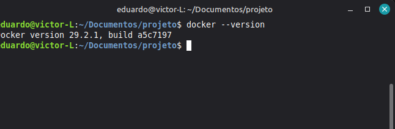
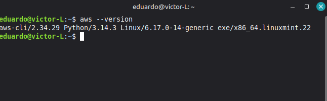
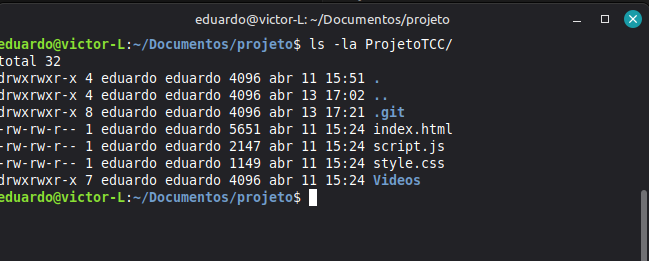
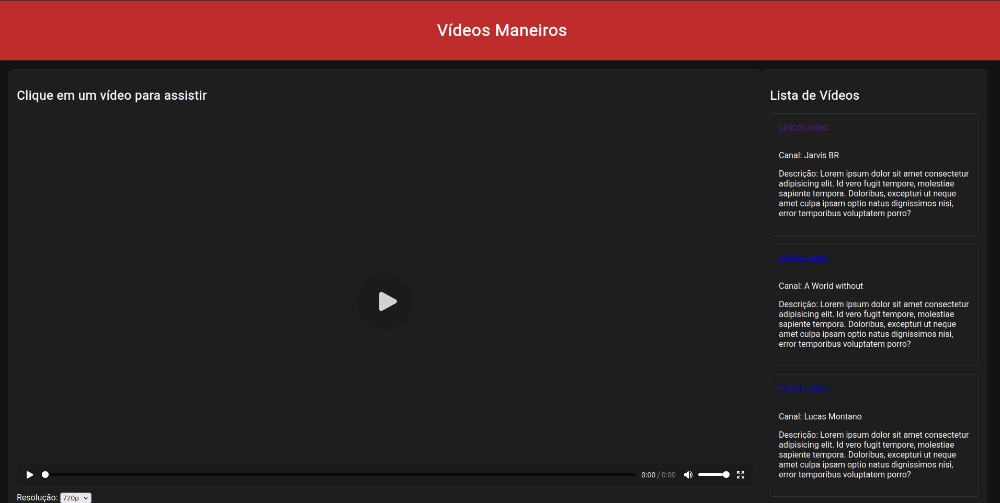

# 🚀 Laboratório DevOps - Projeto 1: Containerização com Docker e Deploy Manual na AWS

## 🎯 Visão Geral

### O que foi construido:
A containerizar um website estático (HTML, CSS e JavaScript) usando Docker e implantá-lo manualmente em uma instância EC2 na AWS, utilizando o Amazon ECR (Elastic Container Registry) para gerenciamento de imagens.

### Por que isso é importante?
- **Portabilidade**: Site funcionará da mesma forma em qualquer ambiente
- **Isolamento**: Elimina problemas de "funciona na minha máquina"
- **Escalabilidade**: Base para futuras implementações mais complexas
- **Padrão da Indústria**: Docker é amplamente utilizado no mercado

- ---

## 🔧 Pré-requisitos

### Ferramentas Necessárias

#### 1. **Docker Desktop**
- **Windows/Mac**: Baixe em [docker.com/products/docker-desktop](https://www.docker.com/products/docker-desktop)
- **Linux**: Instale via terminal:
```bash
curl -fsSL https://get.docker.com -o get-docker.sh
sudo sh get-docker.sh
```

Para verificar a instalação:
```bash
docker --version
```



#### 2. **AWS CLI**
Instale seguindo a [documentação oficial](https://docs.aws.amazon.com/cli/latest/userguide/getting-started-install.html)

Para verificar:
```bash
aws --version
```



#### 3. **Conta AWS**
- Crie uma conta gratuita em [aws.amazon.com](https://aws.amazon.com)
- ⚠️ **Importante**: Alguns recursos podem gerar custos. Use o Free Tier quando possível

#### 4. **Editor de Código**
- Recomendado: [Visual Studio Code](https://code.visualstudio.com/)
- Extensões úteis: Docker, AWS Toolkit

### Estrutura do Projeto
```
meu-projeto/
├── ProjetoTCC/
|   ├──Videos/
|   |    └──Videos2/
|   |    └──Videos3/
|   |    └──Videos4/
│   ├── index.html
│   ├── styles.css
│   ├── script.js
│   └── assets/
│       └── (imagens, fontes, etc.)
└── Dockerfile
```

---
## 🏗️ Arquitetura do Projeto



## 📦 Fase 1: Preparação do Ambiente Local

### Passo 1.1: Verificar estrutura do projeto

Navegue até o diretório do seu projeto:
```bash
cd caminho/para/seu/projeto
ls -la
```

Você deve ver a pasta `ProjetoTCC/` com seus arquivos:
```bash
ls -la ProjetoTCC/
```



### Passo 1.2: Testar o website localmente (opcional)

Você pode abrir o `index.html` diretamente no navegador para verificar se está funcionando:
```bash
# No Mac
open ProjetoTCC/index.html

# No Linux
xdg-open ProjetoTCC/index.html

# No Windows (PowerShell)
start ProjetoTCC/index.html
```



---

## 🐳 Fase 2: Containerização com Docker

### Passo 2.1: Criar o Dockerfile

Na raiz do projeto (mesmo nível da pasta `ProjetoTCC/`), crie um arquivo chamado `Dockerfile`:

```bash
touch Dockerfile
```

### Passo 2.2: Escrever o Dockerfile

Abra o Dockerfile no seu editor e adicione:

```dockerfile
# Imagem base - Nginx Alpine (leve e eficiente)
FROM nginx:alpine

# Copia os arquivos do website para o diretório do Nginx
COPY ProjetoTCC/ /usr/share/nginx/html/

# Expõe a porta 80 (documentação - não abre a porta realmente)
EXPOSE 80

# Comando padrão quando o container iniciar
CMD ["nginx", "-g", "daemon off;"]
```

#### 🎓 Entendendo cada linha:

- **FROM nginx:alpine**: Define a imagem base. Alpine é uma versão Linux super leve
- **COPY**: Copia arquivos do host para dentro da imagem
- **EXPOSE**: Documenta qual porta o container usa
- **CMD**: Define o comando padrão ao iniciar o container

*[Espaço para print: Dockerfile criado no editor]*

### Passo 2.3: Construir a imagem Docker

No terminal, na raiz do projeto, execute:

```bash
docker build -t my-app:v1.0 .

### Passo 2.3: Construir a imagem Docker

No terminal, na raiz do projeto, execute:

```bash
docker build -t my-app:v1.0 .
```

#### 🎓 Entendendo o comando:
- **docker build**: Comando para construir uma imagem
- **-t meu-website:v1.0**: Tag (nome:versão) da imagem
- **.**: Contexto de build (diretório atual)

### Passo 2.4: Verificar a imagem criada

```bash
docker images
```

Você deve ver sua imagem listada:
```
REPOSITORY     TAG       IMAGE ID       CREATED          SIZE
my-app    v1.0      abc123def456   30 seconds ago   23.5MB
```
---

## 🧪 Fase 3: Teste Local do Container

### Passo 3.1: Executar o container localmente

```bash
docker run -d -p 8080:80 --name my-app-container my-app:v1.0
```

#### 🎓 Entendendo o comando:
- **docker run**: Cria e executa um container
- **-d**: Executa em background (detached)
- **-p 8080:80**: Mapeia porta 8080 do host para porta 80 do container
- **--name**: Nome do container
- **my-app:v1.0**: Imagem a ser usada

### Passo 3.2: Verificar se o container está rodando

```bash
docker ps
```

Você verá algo como:
```
CONTAINER ID   IMAGE              COMMAND                  CREATED         STATUS         PORTS                  NAMES
xyz789abc123   my-app:v1.0   "nginx -g 'daemon..."   10 seconds ago  Up 9 seconds   0.0.0.0:8080->80/tcp   my-app-container
```

### Passo 3.3: Testar no navegador

Abra seu navegador e acesse:
```
http://localhost:8080
```

Você deve ver seu website funcionando! 🎉

### Passo 3.4: Verificar logs do container (opcional)

```bash
docker logs my-app-container
```

### Passo 3.5: Parar e remover o container de teste

```bash
# Parar o container
docker stop  my-app-container

# Remover o container
docker rm  my-app-container
```

---

## ☁️ Fase 4: Configuração do Amazon ECR

### Passo 4.1: Acessar o Console AWS

1. Acesse [console.aws.amazon.com](https://console.aws.amazon.com)
2. Faça login com suas credenciais


### Passo 4.2: Navegar para o ECR

1. Na barra de busca superior, digite "ECR"
2. Clique em "Elastic Container Registry"

### Passo 4.3: Criar um repositório

1. Clique em "Create repository"
2. Configure:
   - **Visibility settings**: Private
   - **Repository name**: ` my-app`
   - **Tag immutability**: Disabled (padrão)
   - **Scan on push**: Enabled (recomendado para segurança)
3. Clique em "Create repository"

### Passo 4.4: Anotar a URI do repositório

Após criar, você verá algo como:
```
123456789012.dkr.ecr.us-east-1.amazonaws.com/my-app
```

⚠️ **Importante**: Copie e guarde esta URI, você precisará dela!


---

## 📤 Fase 5: Push da Imagem para o ECR

### Passo 5.1: Configurar AWS CLI

Se ainda não configurou, execute:
```bash
aws configure
```

Você precisará fornecer:
- **AWS Access Key ID**: Obtida no IAM
- **AWS Secret Access Key**: Obtida no IAM
- **Default region**: ex: us-east-1
- **Default output format**: json

### Passo 5.2: Autenticar Docker com ECR

```bash
aws ecr get-login-password --region us-east-1 | docker login --username AWS --password-stdin 123456789012.dkr.ecr.us-east-1.amazonaws.com
```

⚠️ **Substitua**: 
- `us-east-1` pela sua região
- `123456789012` pelo seu Account ID

Você deve ver:
```
Login Succeeded
```

### Passo 5.3: Tagar a imagem para o ECR

```bash
docker tag my-app:v1.0 123456789012.dkr.ecr.us-east-1.amazonaws.com/ my-app:v1.0
```

### Passo 5.4: Push da imagem

```bash
docker push 123456789012.dkr.ecr.us-east-1.amazonaws.com/ my-app:v1.0
```

Você verá o progresso do upload:
```
The push refers to repository [123456789012.dkr.ecr.us-east-1.amazonaws.com/ my-app]
abc123: Pushed
def456: Pushed
v1.0: digest: sha256:xyz789... size: 1234
```

### Passo 5.5: Verificar no Console AWS

1. Volte ao ECR no console AWS
2. Clique no seu repositório
3. Você deve ver a imagem com a tag v1.0

---

## 🖥️ Fase 6: Provisionamento da Instância EC2

### Passo 6.1: Navegar para EC2

1. No console AWS, busque por "EC2"
2. Clique em "EC2"

### Passo 6.2: Lançar instância

1. Clique em "Launch Instance"
2. Configure:

#### Nome e tags
- **Name**: ` my-app-server`

#### Imagem de aplicação e sistema operacional
- **AMI**: Amazon Linux 2023 (Free tier eligible)


#### Tipo de instância
- **Instance type**: t2.micro (Free tier eligible)


#### Par de chaves
- Clique em "Create new key pair"
- **Key pair name**: ` my-app-key`
- **Key pair type**: RSA
- **Private key file format**: .pem (Linux/Mac) ou .ppk (Windows/PuTTY)
- Clique em "Create key pair" e salve o arquivo

⚠️ **IMPORTANTE**: Guarde este arquivo com segurança! Você precisará dele para acessar a EC2.

### Passo 6.3: Configurar IAM Role (Permissões para ECR)

#### Criar IAM Role
1. Em "Advanced details", encontre "IAM instance profile"
2. Clique em "Create new IAM profile"
3. Ou vá para IAM Console e:
   - Clique em "Roles" → "Create role"
   - **Trusted entity**: AWS service
   - **Use case**: EC2
   - **Permissions**: Adicione `AmazonEC2ContainerRegistryReadOnly`
   - **Role name**: `EC2-ECR-Role`

4. Volte para a configuração da EC2 e selecione o role criado

### Passo 6.4: Revisar e lançar

1. Revise todas as configurações
2. Clique em "Launch instance"
3. Aguarde a instância inicializar (status: running)

### Passo 6.5: Anotar informações importantes

Anote:
- **Public IP**: Ex: 54.123.45.67
- **Instance ID**: Ex: i-0abc123def456789

---

## 🚀 Fase 7: Deploy na EC2

### Passo 7.1: Conectar à instância EC2

#### No Linux/Mac:
```bash
# Ajustar permissões da chave
chmod 400 my-app-key.pem

# Conectar via SSH
ssh -i my-app-key.pem ec2-user@54.123.45.67
```

#### No Windows (usando PuTTY):
1. Converta a chave .pem para .ppk usando PuTTYgen
2. Use PuTTY para conectar com a chave .ppk

Você verá:
```
   ,     #_
   ~\_  ####_        Amazon Linux 2023
  ~~  \_#####\
  ~~     \###|
  ~~       \#/ ___   https://aws.amazon.com/linux/amazon-linux-2023
   ~~       V~' '->
    ~~~         /
      ~~._.   _/
         _/ _/
       _/m/'
[ec2-user@ip-172-31-xx-xx ~]$
```

### Passo 7.2: Instalar Docker na EC2

```bash
# Atualizar pacotes
sudo yum update -y

# Instalar Docker
sudo yum install docker -y

# Iniciar serviço Docker
sudo systemctl start docker

# Habilitar Docker no boot
sudo systemctl enable docker

# Adicionar ec2-user ao grupo docker
sudo usermod -a -G docker ec2-user

# Verificar instalação
docker --version
```

### Passo 7.3: Fazer logout e login novamente

```bash
# Sair
exit

# Conectar novamente
ssh -i my-app-key.pem ec2-user@54.123.45.67
```

### Passo 7.4: Autenticar Docker com ECR na EC2

```bash
aws ecr get-login-password --region us-east-1 | docker login --username AWS --password-stdin 123456789012.dkr.ecr.us-east-1.amazonaws.com
```

### Passo 7.5: Pull da imagem do ECR

```bash
docker pull 123456789012.dkr.ecr.us-east-1.amazonaws.com/my-app:v1.0
```

Você verá:
```
v1.0: Pulling from my-app
Status: Downloaded newer image for 123456789012.dkr.ecr.us-east-1.amazonaws.com/my-app:v1.0
```

### Passo 7.6: Executar o container

```bash
docker run -d -p 80:80 --name my-app-prod --restart always 123456789012.dkr.ecr.us-east-1.amazonaws.com/my-app:v1.0
```

#### 🎓 Parâmetros importantes:
- **--restart always**: Reinicia o container se a EC2 reiniciar
- **-p 80:80**: Mapeia porta 80 (padrão HTTP)

### Passo 7.7: Verificar se está rodando

```bash
# Verificar container
docker ps

# Verificar logs
docker logs my-app-prod
```

---

## ✅ Verificação e Testes

### Teste 1: Acessar pelo navegador

1. Abra seu navegador
2. Digite o IP público da EC2: `http://54.123.45.67`
3. Seu website deve aparecer! 🎉


### Teste 2: Verificar logs na EC2

```bash
# Logs do container
docker logs -f my-app-prod

# Status do container
docker stats my-app-prod
```

### Teste 3: Testar reinicialização

```bash
# Parar o container
docker stop my-app-prod

# Verificar se parou
docker ps

# Iniciar novamente
docker start my-app-prod

# Verificar se voltou
docker ps
```

---

## 🔧 Troubleshooting

### Problema 1: "Cannot connect to the Docker daemon"

**Solução**:
```bash
sudo systemctl start docker
sudo usermod -a -G docker $USER
# Fazer logout e login novamente
```

### Problema 2: Site não abre no navegador

**Verificações**:
1. Security Group tem porta 80 aberta?
2. Container está rodando? (`docker ps`)
3. IP público está correto?
4. Teste com curl na EC2: `curl localhost`

### Problema 3: "No basic auth credentials" no pull do ECR

**Solução**:
```bash
# Re-autenticar
aws ecr get-login-password --region us-east-1 | docker login --username AWS --password-stdin [ECR_URI]
```

### Problema 4: Permissão negada no Docker

**Solução**:
```bash
# Adicionar usuário ao grupo docker
sudo usermod -a -G docker ec2-user
# Logout e login
exit
ssh -i key.pem ec2-user@IP
```

---

## 🧹 Limpeza de Recursos

⚠️ **IMPORTANTE**: Para evitar custos, limpe os recursos após o laboratório!

### Passo 1: Parar e remover container na EC2

```bash
docker stop my-app-prod
docker rm my-app-prod
docker rmi 123456789012.dkr.ecr.us-east-1.amazonaws.com/my-app:v1.0
```

### Passo 2: Terminar instância EC2

1. Console AWS → EC2
2. Selecione sua instância
3. Actions → Instance State → Terminate

### Passo 3: Deletar imagem do ECR

1. Console AWS → ECR
2. Selecione o repositório
3. Selecione a imagem
4. Delete

### Passo 4: Deletar repositório ECR (opcional)

1. Selecione o repositório
2. Delete

### Passo 5: Deletar Security Group

1. EC2 → Security Groups
2. Selecione `my-app-sg`
3. Actions → Delete

### Passo 6: Deletar IAM Role (opcional)

1. IAM → Roles
2. Selecione `EC2-ECR-Role`
3. Delete

---

## 🎓 Conceitos Aprendidos

✅ **Containerização**: Empacotamento de aplicações com suas dependências

✅ **Docker**: Plataforma para criar e executar containers

✅ **Dockerfile**: Arquivo de configuração para construir imagens

✅ **ECR**: Registro privado de imagens Docker na AWS

✅ **EC2**: Máquinas virtuais na nuvem AWS

✅ **Security Groups**: Firewall virtual para EC2

✅ **IAM Roles**: Gerenciamento de permissões na AWS

---
## 📚 Recursos Adicionais

- [Documentação Docker](https://docs.docker.com/)
- [AWS ECR Documentation](https://docs.aws.amazon.com/ecr/)
- [AWS EC2 User Guide](https://docs.aws.amazon.com/ec2/)
- [Best Practices for Dockerfile](https://docs.docker.com/develop/dev-best-practices/)
- [Referencia do projeto original](https://www.youtube.com/watch?v=UEoxMU_l2xs&t=1334s)

---


